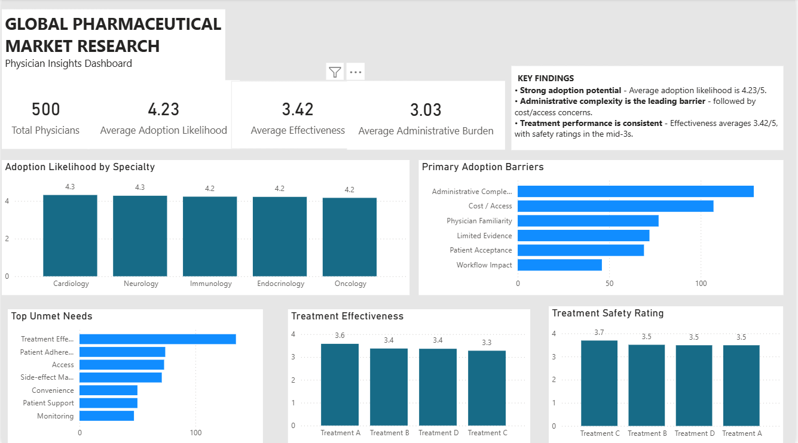

# Global Pharmaceutical Market Research Program

## Physician Insights, Market Research & Analytics Portfolio



---

## Overview

This portfolio case study demonstrates the planning, coordination, research, and analytics involved in a simulated global pharmaceutical market research program supporting strategic business decisions for a multinational pharmaceutical client.

The program consists of multiple concurrent qualitative and quantitative research activities designed to generate insights into physician behavior, treatment perceptions, adoption barriers, unmet needs, and market dynamics.

The project demonstrates an end-to-end workflow combining:

- Project Management
- Healthcare Market Research
- Quantitative Research
- Qualitative Research
- PostgreSQL
- SQL
- Power BI
- DAX
- Business Analysis
- Executive Reporting

As the Project Coordinator, the focus is on coordinating timelines, stakeholders, deliverables, risks, research activities, and reporting while also using data and analytics to translate research findings into actionable business insights.

> **Portfolio note:** This is a fictional portfolio case study using synthetic data. It does not contain confidential client, patient, physician, or proprietary information.

---

## Business Challenge

The client requires reliable market intelligence to support commercial strategy, product planning, and evidence-based decision-making across multiple therapeutic areas.

Managing multiple research studies simultaneously requires structured governance, effective stakeholder communication, resource planning, proactive risk management, and clear reporting.

The analytics component of the program focuses on understanding physician perceptions of pharmaceutical treatments and identifying factors that may influence treatment adoption.

---

## Objectives

- Deliver multiple market research studies on schedule.
- Maintain high-quality research deliverables.
- Coordinate cross-functional teams and stakeholders.
- Improve visibility into project progress.
- Analyze physician survey data.
- Identify treatment adoption drivers and barriers.
- Identify important unmet needs.
- Compare treatment effectiveness and safety perceptions.
- Support informed business decisions through timely reporting and analytics.

---

## My Responsibilities

- Project coordination
- Timeline management
- Stakeholder communication
- Meeting coordination
- Deliverable tracking
- Risk and issue monitoring
- Executive status reporting
- Cross-functional collaboration
- Research planning support
- Quantitative research coordination
- Data analysis and interpretation
- Dashboard development
- Business insight generation

---

# Market Research Analytics

## Research Question

The quantitative research component was designed to understand physician perceptions across specialties and treatments.

Key questions included:

1. How likely are physicians to adopt the treatments being evaluated?
2. Does adoption likelihood vary across specialties?
3. What are the primary barriers to treatment adoption?
4. What unmet needs are most frequently identified?
5. How do physicians perceive treatment effectiveness?
6. How do physicians perceive treatment safety?

---

## Dataset

The analysis uses a synthetic physician survey dataset containing:

**500 physician respondents**

The dataset includes variables relating to:

- Physician specialty
- Primary treatment
- Treatment effectiveness
- Treatment safety
- Adoption likelihood
- Administrative burden
- Adoption barriers
- Unmet needs
- Physician experience
- Practice setting
- Patient volume
- Other physician perception measures

---

# Power BI Dashboard

The physician survey data was analyzed and visualized in Microsoft Power BI to create an executive-level **Physician Insights Dashboard**.

The dashboard includes:

- KPI cards
- Adoption likelihood by specialty
- Primary adoption barriers
- Top unmet needs
- Treatment effectiveness
- Treatment safety ratings
- Executive key findings

### Key KPIs

| KPI | Result |
|---|---:|
| Total Physicians | 500 |
| Average Adoption Likelihood | 4.23 / 5 |
| Average Effectiveness | 3.42 / 5 |
| Average Administrative Burden | 3.03 / 5 |

---

## Key Findings

### 1. Strong Adoption Potential

Average physician adoption likelihood is **4.23/5**, indicating strong overall willingness to consider treatment adoption.

### 2. Administrative Complexity Is the Leading Barrier

Administrative complexity is the most frequently reported adoption barrier, followed by cost/access concerns.

This highlights the importance of reducing operational friction alongside demonstrating clinical value.

### 3. Adoption Is Relatively Consistent Across Specialties

Average adoption likelihood remains relatively close across the physician specialties represented in the dataset.

This suggests that adoption opportunity is not concentrated in only one specialty.

### 4. Treatment Effectiveness Is Relatively Consistent

Average effectiveness is **3.42/5**, with treatment-level averages generally falling within the mid-3 range.

### 5. Safety Perceptions Remain Relatively Stable

Treatment safety ratings remain in the mid-3 range across the treatments evaluated.

---

# Business Recommendations

Based on the analysis, pharmaceutical market strategy teams could consider:

### Reduce Administrative Friction

Simplify administrative processes, documentation requirements, authorization workflows, and implementation steps where possible.

### Address Cost and Access

Further investigate affordability, reimbursement, coverage, and access barriers affecting treatment adoption.

### Strengthen Evidence Communication

Develop clear evidence-based communication addressing clinical effectiveness and physician concerns.

### Improve Patient Support

Explore patient education, adherence support, and patient-facing resources where unmet needs are identified.

### Support Clinical Workflow Integration

Treatments that integrate effectively into existing clinical workflows may encounter fewer adoption barriers.

---

# SQL Analysis

PostgreSQL was used to store and analyze the physician survey dataset.

The SQL analysis demonstrates:

- Data exploration
- Aggregation
- Physician segmentation
- Adoption analysis
- Treatment analysis
- Adoption barrier analysis
- Unmet-needs analysis
- Ranking
- Window functions
- Business-oriented filtering

### SQL Concepts Demonstrated

- `SELECT`
- `COUNT()`
- `AVG()`
- `GROUP BY`
- `HAVING`
- `ORDER BY`
- Subqueries
- `ROW_NUMBER()`
- Window functions
- Multi-dimensional segmentation

The SQL analysis is documented in:

**`15-Healthcare-Market-Research-SQL-Analysis.sql`**

---

# Power BI & DAX

Power BI was used to transform the physician survey dataset into an executive dashboard.

Key DAX measures include:

```DAX
Total Physicians =
DISTINCTCOUNT('public physician_survey'[respondent_id])
Average Adoption Likelihood =
AVERAGE('public physician_survey'[likelihood_to_adopt])
Average Effectiveness =
AVERAGE('public physician_survey'[effectiveness_rating])
Average Administrative Burden =
AVERAGE('public physician_survey'[administrative_burden_rating])
Average Safety Rating =
AVERAGE('public physician_survey'[safety_rating])
```

# End-to-End Workflow

Project & Research Planning  
↓  
Stakeholder & Risk Management  
↓  
Qualitative & Quantitative Research Design  
↓  
Physician Survey Dataset  
↓  
PostgreSQL Database  
↓  
SQL Analysis  
↓  
Power BI + DAX

---

## Key Findings

- **Strong adoption potential** — Average adoption likelihood is **4.23/5**.
- **Administrative complexity is the leading barrier** — followed by **cost/access concerns**.
- **Treatment performance is consistent** — effectiveness averages **3.42/5**, with safety ratings in the mid-3s.
- **Physician insights vary only slightly across specialties**, indicating broadly consistent adoption potential.
- **Treatment effectiveness is relatively consistent** across the treatments evaluated.

---

## Tools & Technologies

- Power BI
- DAX
- SQL
- PostgreSQL
- Excel
- GitHub
- Quantitative Research
- Qualitative Research
- Project Management

---

## Project Management Skills Demonstrated

- Project planning and scheduling
- Stakeholder management
- Risk and issue management
- Research coordination
- Cross-functional collaboration
- Data analysis and reporting
- Executive dashboard development
- KPI tracking
- Business insight generation

---

## Portfolio Purpose

This project demonstrates how **project management, healthcare market research, SQL analysis, and Power BI** can be combined to transform research data into actionable business insights.

It is designed as a portfolio case study demonstrating both **project delivery capabilities and hands-on analytical skills**.

---

**Status:** ✅ Completed
