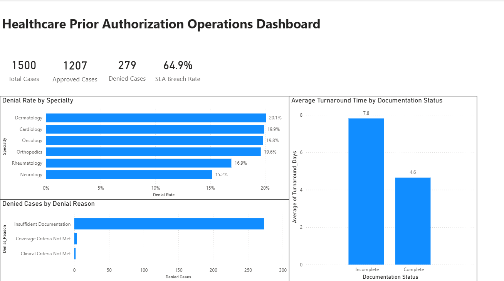

# Healthcare Prior Authorization Operations Dashboard

## Project Overview

A healthcare operations analytics project designed to evaluate prior authorization workload, authorization outcomes, denial patterns, documentation issues, and SLA performance.

The analysis uses Power BI and DAX to transform operational data into an executive-level dashboard that supports process improvement and healthcare operations decision-making.

## Business Problem

Prior authorization workflows can involve significant manual documentation, multiple stakeholders, and time-sensitive service-level requirements.

The objective of this project was to identify operational bottlenecks and opportunities to improve turnaround time, reduce avoidable denials, and strengthen SLA performance.

## Tools & Skills

- Microsoft Power BI
- DAX
- Healthcare Operations Analytics
- KPI Development
- Data Visualization
- Process Improvement
- Project Management

## Dashboard

## Key Findings

- **1,500** prior authorization cases were analyzed.
- **80.5%** of cases were approved, while **279** cases were denied.
- **64.9%** of cases breached the defined SLA, indicating a significant operational efficiency issue.
- Cases with incomplete documentation had an average turnaround time of approximately **7.8 days**, compared with **4.6 days** for complete documentation.
- **Insufficient Documentation** was the dominant denial reason.
- Denial rates varied across specialties, with Dermatology showing the highest rate at **20.1%**.

## Recommendation

### Implement an Electronic Prior Authorization (ePA) Workflow

The analysis suggests an opportunity to reduce manual documentation handling through an electronic prior authorization workflow.

Potential improvements include:

- Structured electronic documentation capture
- Automated completeness checks
- Standardized submission requirements
- Reduced manual data entry
- Automated status tracking

This could help reduce administrative rework, improve turnaround time, reduce documentation-related denials, and strengthen SLA performance.

## Project Deliverables

- Power BI healthcare operations dashboard
- KPI and DAX documentation
- Operational performance analysis
- Process improvement recommendation

### Technical Documentation & Analysis

[View DAX & KPI Documentation](02-DAX-KPI-Documentation.md)
