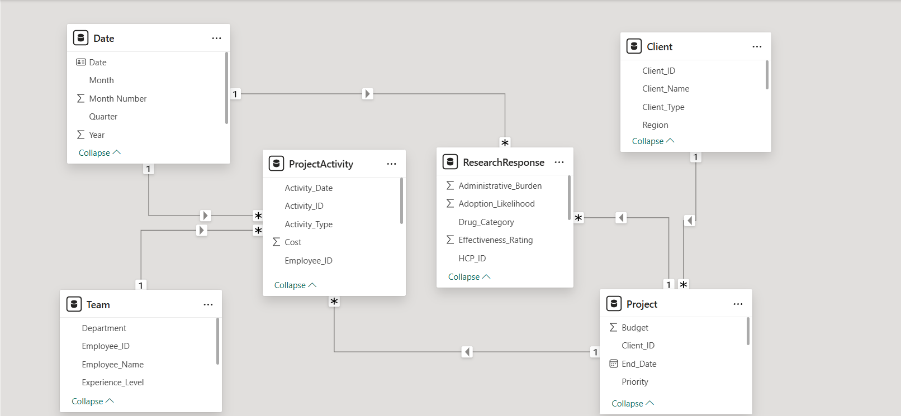
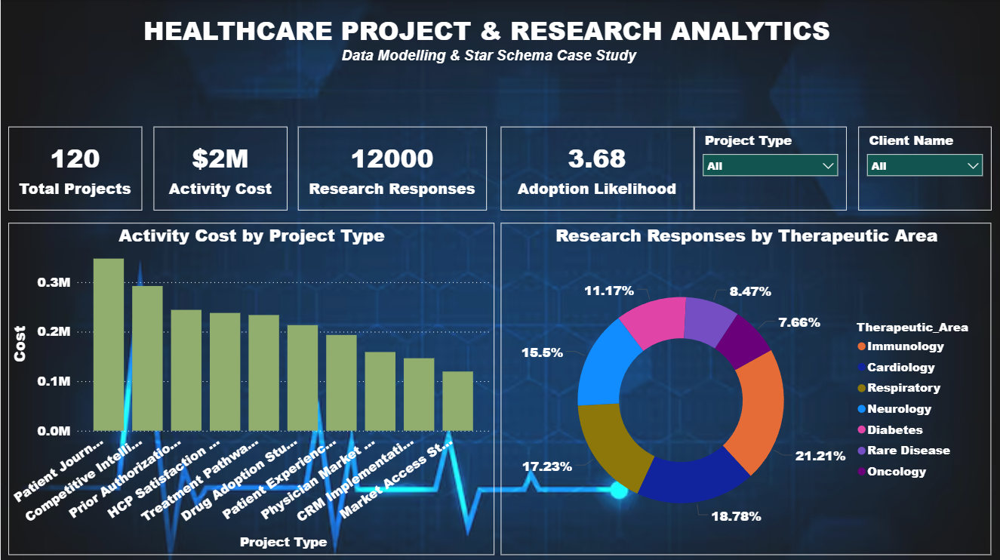

# Healthcare Project & Research Analytics

### Data Modelling & Star Schema Case Study

---

## 📌 Project Overview

This case study demonstrates the design and implementation of a healthcare-focused analytical data model in Microsoft Power BI.

The model combines **project management activity** and **healthcare market research** data into a structured dimensional model designed to support consistent business analysis.

---

## 🎯 Business Objective

The model was designed to answer questions such as:

- How much operational activity cost is associated with different project types?
- How are research responses distributed across therapeutic areas?
- How many projects are being managed?
- What is the average healthcare professional adoption likelihood?
- Can common dimensions consistently filter multiple fact tables?

---

## 🗂️ Data Model

The solution uses a **Star Schema / dimensional modelling approach** with dimension and fact tables.

### Dimension Tables

| Table | Description |
|---|---|
| `Dim_Client` | Client attributes including client type, region, and therapeutic area |
| `Dim_Project` | Project attributes including project type, research method, status, priority, dates, and budget |
| `Dim_Team` | Team member attributes including role, department, location, and experience level |
| `Dim_Date` | Centralized calendar dimension for time-based analysis |

### Fact Tables

| Table | Description |
|---|---|
| `Fact_ProjectActivity` | Project activity records containing hours worked, cost, tasks completed, and issue metrics |
| `Fact_ResearchResponse` | Healthcare research response records containing adoption, effectiveness, safety, and administrative-burden ratings |

---

## 🔗 Relationship Design

The model uses **one-to-many relationships** with **single-direction filtering from dimensions toward fact tables**.

Key relationships:

```text
Dim_Client[Client_ID]
        ↓ 1 : *
Dim_Project[Client_ID]


Dim_Project[Project_ID]
        ↓ 1 : *
Fact_ProjectActivity[Project_ID]


Dim_Project[Project_ID]
        ↓ 1 : *
Fact_ResearchResponse[Project_ID]


Dim_Team[Employee_ID]
        ↓ 1 : *
Fact_ProjectActivity[Employee_ID]


Dim_Date[Date]
        ↓ 1 : *
Fact_ProjectActivity[Activity_Date]


Dim_Date[Date]
        ↓ 1 : *
Fact_ResearchResponse[Response_Date]
```

Relationships were explicitly reviewed rather than relying solely on automatic relationship detection.

---

## ⭐ Why a Star Schema?

The dimensional model separates **descriptive attributes** from **measurable business events**.

This approach helps:

- simplify analytical queries
- provide predictable filter propagation
- reduce unnecessary relationship complexity
- create reusable dimensions
- support analysis across multiple business processes

This model contains two primary business processes:

1. **Project Operations**
2. **Healthcare Market Research**

Shared dimensions such as `Dim_Project` and `Dim_Date` allow consistent analysis across both processes.

---

## 📊 DAX Measures

### Total Projects

```DAX
Total Projects =
DISTINCTCOUNT(Dim_Project[Project_ID])
```

### Total Activity Cost

```DAX
Total Activity Cost =
SUM(Fact_ProjectActivity[Cost])
```

### Total Research Responses

```DAX
Total Research Responses =
COUNTROWS(Fact_ResearchResponse)
```

### Average Adoption Likelihood

```DAX
Average Adoption Likelihood =
AVERAGE(Fact_ResearchResponse[Adoption_Likelihood])
```

---

## 📈 Power BI Analysis

The analytical page includes:

- **Total Projects**
- **Activity Cost**
- **Research Responses**
- **Average Adoption Likelihood**
- **Activity Cost by Project Type**
- **Research Responses by Therapeutic Area**
- **Project Type filter**
- **Client filter**

---

## 🖼️ Screenshots

### Data Model



### Analytical View



---

## 🛠️ Tools & Techniques

- Microsoft Power BI Desktop
- Power Query
- DAX
- Data Modelling
- Star Schema
- Dimensional Modelling
- One-to-Many Relationships
- KPI Development
- Healthcare Analytics

---

## 📁 Dataset Structure

```text
Dataset/
├── Dim_Client.csv
├── Dim_Project.csv
├── Dim_Team.csv
├── Fact_ProjectActivity.csv
└── Fact_ResearchResponse.csv
```

---

## 🔐 Dataset Disclaimer

The datasets used in this case study are **synthetic datasets created specifically for portfolio and data-modelling demonstration purposes**.

They contain no real patient, healthcare professional, employee, or client information.

---

## 💡 Key Takeaway

This project demonstrates that effective Power BI reporting starts with a well-designed underlying data model.

The focus of this case study was not only on creating visuals, but on understanding and implementing the relationships between **dimensions and business-process fact tables** to support reliable and scalable analysis.
