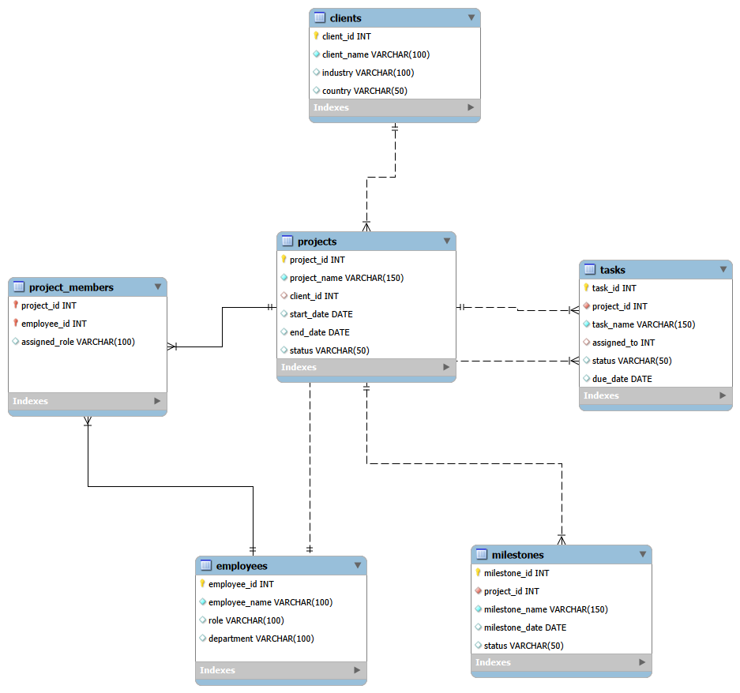

# Healthcare Project Management Database

## Overview

This project demonstrates the design and implementation of a relational database for managing healthcare project delivery.

The database models clients, projects, employees, project team assignments, project tasks, and project milestones using MySQL.

The project was created to practice database design, Entity-Relationship (ER) modelling, primary and foreign keys, relational integrity, JOINs, aggregation, and analytical SQL queries.

---

## Business Scenario

A healthcare consulting organization manages multiple projects for healthcare, pharmaceutical, biotechnology, and healthcare technology clients.

Each project may have:

- One client
- Multiple employees
- Multiple tasks
- Multiple milestones

Employees can also work across multiple projects. A junction table, `project_members`, is therefore used to model the many-to-many relationship between projects and employees.

---

## Database Structure

| Table | Purpose |
|---|---|
| `clients` | Stores client organizations |
| `projects` | Stores project information and client relationships |
| `employees` | Stores project team members |
| `project_members` | Resolves the many-to-many relationship between projects and employees |
| `tasks` | Stores project tasks and task assignments |
| `milestones` | Stores project milestones and dates |

---

## ER Diagram

The ER diagram was created in MySQL Workbench by reverse-engineering the completed database.



---

## Key Relationships

### Client → Projects

One client can have multiple projects.

```text
clients (1) ───────< projects (many)
```

`projects.client_id` is a foreign key referencing `clients.client_id`.

### Projects ↔ Employees

A project can have multiple employees, and an employee can work on multiple projects.

```text
projects (1) ───────< project_members >─────── (1) employees
```

The `project_members` table resolves this many-to-many relationship.

It uses a composite primary key:

```sql
PRIMARY KEY (project_id, employee_id)
```

### Projects → Tasks

One project can contain multiple tasks.

```text
projects (1) ───────< tasks (many)
```

### Employees → Tasks

An employee can be assigned multiple tasks.

```text
employees (1) ───────< tasks (many)
```

### Projects → Milestones

One project can contain multiple milestones.

```text
projects (1) ───────< milestones (many)
```

---

## SQL Concepts Demonstrated

- INNER JOIN
- LEFT JOIN
- Multiple-table JOINs
- COUNT and GROUP BY
- Composite primary keys
- Relational data modelling

---

## Analysis Queries

The analysis script answers questions such as:

1. Which client is associated with each project?
2. How many employees are assigned to each project?
3. Which projects is each employee working on?
4. Which employee is assigned to each task?
5. How many tasks does each project contain?
6. How are tasks distributed by status?
7. Which employees are working across multiple projects?
8. What milestones are associated with each project?

---

## Sample Data

The database contains:

- 5 clients
- 7 employees
- 5 projects
- 15 project-team assignments
- 18 tasks
- 15 milestones

---

## Project Files

```text
08-Healthcare-Project-Management-Database/
│
├── README.md
│
├── SQL/
│   ├── 01_create_database.sql
│   ├── 02_create_tables.sql
│   ├── 03_insert_data.sql
│   └── 04_analysis_queries.sql
│
└── ER_Diagram/
    ├── healthcare_project_management_erd.png
    └── healthcare_project_management.mwb
```

---

## Tools Used

- MySQL
- MySQL Workbench
- SQL
- ER/EER Modelling

---

## Learning Outcome

This project helped me move beyond writing individual SQL queries and understand how relational databases are structured before analysis begins.

The workflow covered:

**Business requirements → Database design → ER modelling → Table relationships → Data insertion → SQL analysis**
